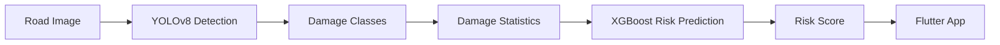

# AI Module
## InfraGuard AI

> This document explains the Artificial Intelligence module of InfraGuard AI, including the dataset, training workflow, preprocessing pipeline, model architecture, and deployment strategy.

---

# Table of Contents

- AI Module Overview
- Objectives
- AI Workflow
- Dataset
- Damage Classes
- Project Directory
- AI Development Workflow
- Training Pipeline
- Inference Pipeline
- Technologies Used
- Design Decisions
- Current Progress
- Next Steps

---

# 1. AI Module Overview

The AI module is responsible for detecting road damage from uploaded images and generating information that will later be used to estimate the road's risk level.

The AI module consists of two parts:

1. Computer Vision (YOLOv8)
2. Risk Prediction (XGBoost)

The current development phase focuses on the Computer Vision module.

---

# 2. Objectives

The AI module should be able to:

- Detect road damage from images
- Identify different damage types
- Return bounding boxes
- Provide damage statistics
- Supply features for the risk prediction model

---

# 3. AI Workflow



---

# 4. Dataset

## Selected Dataset

RDD2022

Reason for choosing it:

- Publicly available
- Large dataset
- Road-specific images
- Compatible with YOLO
- Well documented

The dataset is downloaded using the Kaggle API.

---

# 5. Damage Classes

We will train the model using **4 classes**.

| Class | Used |
|---------|------|
| Longitudinal Crack | ✅ |
| Transverse Crack | ✅ |
| Alligator Crack | ✅ |
| Pothole | ✅ |
| Other Corruption | ❌ Removed |

### Why remove "Other Corruption"?

The class is too broad and does not contribute meaningfully to the project's risk prediction objective.

Removing it simplifies the model and improves consistency.

---

# 6. AI Project Structure

```text
ai/

├── computer_vision/
│
│   ├── configs/
│   ├── data/
│   │
│   ├── preprocessing/
│   ├── training/
│   ├── evaluation/
│   ├── inference/
│   ├── models/
│   ├── exports/
│   ├── tests/
│   └── utils/
│
└── risk_prediction/
```

---

# 7. AI Development Workflow

The AI code is written locally but trained in Google Colab.

```mermaid
flowchart LR

Cursor

--> GitHub

--> Google Colab

--> Google Drive

--> Cursor
```

### Responsibilities

| Task | Platform |
|---------|----------|
| Write AI code | Cursor |
| Commit code | Cursor |
| Train YOLO | Google Colab |
| Store dataset | Google Drive |
| Store trained model | Google Drive |
| Backend Integration | Cursor |

---

# 8. Training Pipeline

```mermaid
flowchart LR

RDD2022

--> Dataset Inspection

--> Class Filtering

--> YOLO Training

--> Validation

--> best.pt
```

Current training plan:

1. Download dataset
2. Verify dataset
3. Remove unwanted class
4. Train YOLOv8
5. Evaluate performance
6. Export best.pt

---

# 9. Inference Pipeline

```mermaid
flowchart LR

Image

--> FastAPI

--> YOLOv8

--> Damage Detection

--> Prediction Result

--> Flutter
```

The backend loads the trained **best.pt** model and performs inference whenever an image is uploaded.

---

# 10. Technologies Used

| Purpose | Technology |
|----------|------------|
| Computer Vision | YOLOv8 |
| Risk Prediction | XGBoost |
| Explainability | SHAP |
| Dataset | RDD2022 |
| Development | Cursor IDE |
| Training | Google Colab |
| Version Control | Git |
| Repository | GitHub |

---

# 11. Design Decisions

## Why Google Colab?

The local system does not have an NVIDIA GPU.

Google Colab provides free GPU resources for model training.

---

## Why YOLOv8?

- Fast
- Accurate
- Easy deployment
- Active community
- Suitable for real-time inference

---

## Why Cursor?

Cursor is used for writing and managing the project code.

No model training is performed locally.

---

# 12. Current Progress

## Completed

- AI architecture finalized
- Dataset selected
- Kaggle API configured
- Python environment created
- Google Colab environment prepared
- Folder structure finalized
- Selected 4 damage classes

---

## In Progress

- Dataset download pipeline
- Dataset inspection
- Dataset preprocessing

---

## Upcoming

- Train YOLOv8
- Evaluate model
- Export best.pt
- Integrate with FastAPI
- Develop XGBoost risk model

---

# 13. Future AI Pipeline

```mermaid
flowchart LR

Road Image

--> YOLOv8

--> Damage Detection

--> Feature Extraction

--> XGBoost

--> SHAP

--> Risk Report

--> Flutter Dashboard
```

---

# Related Documents

- PROJECT_MASTER.md
- DEVELOPMENT_WORKFLOW.md