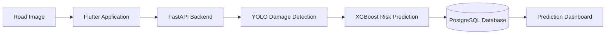
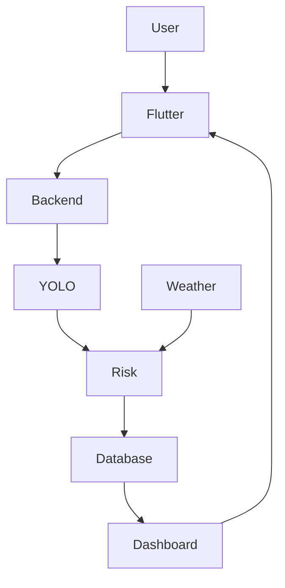
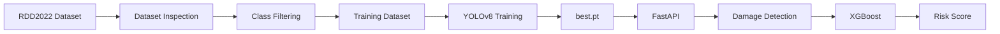
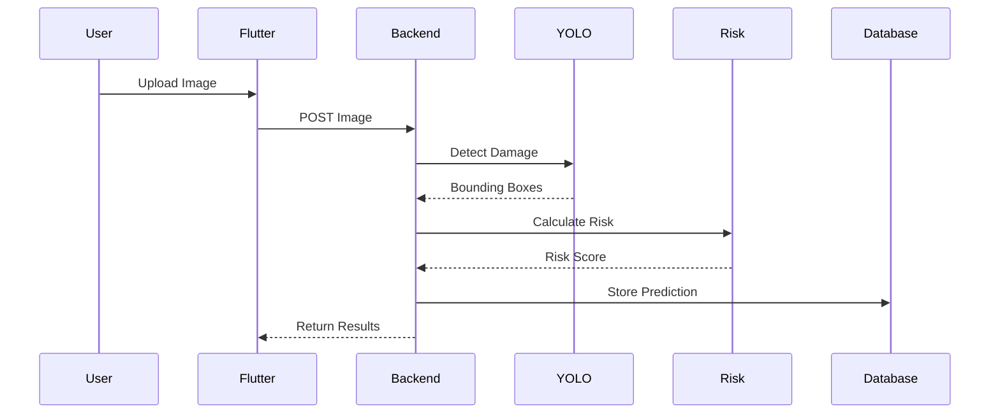
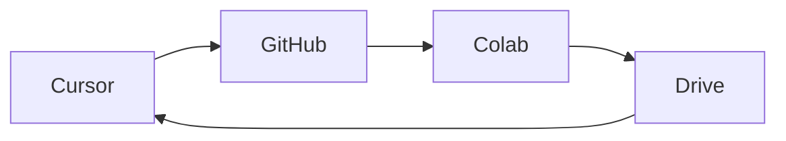

# InfraGuard AI
### AI-Driven Public Infrastructure Failure Prediction System

> **Version:** 1.0
>
> **Status:** Design Finalized | Development Started
>
> **Project Type:** Final Year Engineering Project
>
> **Repository:** InfraGuard-AI

---

# Table of Contents

- [1. Project Overview](#1-project-overview)
- [2. Problem Statement](#2-problem-statement)
- [3. Project Objectives](#3-project-objectives)
- [4. Scope](#4-scope)
- [5. Key Features](#5-key-features)
- [6. System Overview](#6-system-overview)
- [7. Overall Architecture](#7-overall-architecture)
- [8. Technology Stack](#8-technology-stack)
- [9. Repository Structure](#9-repository-structure)
- [10. AI Pipeline](#10-ai-pipeline)
- [11. Application Workflow](#11-application-workflow)
- [12. Development Workflow](#12-development-workflow)
- [13. Team Modules](#13-team-modules)
- [14. Current Progress](#14-current-progress)
- [15. Future Scope](#15-future-scope)
- [16. References](#16-references)

---

# 1. Project Overview

InfraGuard AI is an AI-powered software platform designed to help municipal authorities monitor road infrastructure and predict future road failures before they become severe.

Instead of relying only on manual inspections, the system combines Computer Vision, Machine Learning, historical maintenance data, weather conditions and road metadata to estimate the health of road segments and recommend preventive maintenance.

The project consists entirely of software components.

No IoT devices or embedded hardware are used.

---

# 2. Problem Statement

Road inspections are usually performed manually.

This creates several challenges:

- Expensive inspections
- Slow reporting
- Delayed maintenance
- Human errors
- Lack of predictive maintenance
- Poor prioritization of repairs

Most existing systems identify damage only after it becomes severe.

InfraGuard AI aims to shift from **reactive maintenance** to **predictive maintenance**.

---

# 3. Project Objectives

## Primary Objective

Develop an AI-powered platform capable of detecting road damage and predicting future infrastructure degradation using multiple data sources.

---

## Secondary Objectives

- Detect road damage from uploaded images.
- Classify different types of cracks and potholes.
- Estimate road risk score.
- Assist municipal authorities in prioritizing maintenance.
- Store historical inspection records.
- Provide explainable AI predictions.

---

# 4. Scope

## Included

- Road damage detection
- AI prediction
- Risk scoring
- Flutter mobile application
- FastAPI backend
- PostgreSQL database
- Weather integration
- Explainable AI

---

## Excluded

- IoT Sensors
- Drones
- Embedded Systems
- Real-time CCTV feeds
- Autonomous inspection vehicles

---

# 5. Key Features

- Image Upload
- AI Damage Detection
- Damage Classification
- Risk Prediction
- Explainable Predictions
- Maintenance Recommendation
- Historical Reports
- Dashboard
- User Authentication

---

# 6. System Overview



The user uploads an image.

The backend performs AI inference.

The prediction is stored in the database.

The results are displayed inside the mobile application.

---

# 7. Overall Architecture



---

# 8. Technology Stack

| Layer | Technology |
|----------|------------|
| Frontend | Flutter |
| Backend | FastAPI |
| AI Detection | YOLOv8 |
| Risk Prediction | XGBoost |
| Explainability | SHAP |
| Database | PostgreSQL |
| Version Control | Git & GitHub |
| Development | Cursor IDE |
| Model Training | Google Colab |
| Model Storage | Google Drive |

---

# 9. Repository Structure

```text
InfraGuard-AI/

│

├── ai/

│   ├── computer_vision/

│   ├── risk_prediction/

│

├── backend/

│

├── mobile_app/

│

├── database/

│

├── docs/

│

└── deployment/
```

---

# 10. AI Pipeline



---

## Dataset

Dataset Used:

**RDD2022**

Reason:

- Large scale
- Public dataset
- Road damage specific
- YOLO compatible

---

## Damage Classes

| Class | Used |
|---------|------|
| Longitudinal Crack | ✅ |
| Transverse Crack | ✅ |
| Alligator Crack | ✅ |
| Pothole | ✅ |
| Other Corruption | ❌ Removed |

Reason for removal:

The "Other Corruption" class is ambiguous and does not contribute meaningfully to the project's risk prediction objectives.

---

# 11. Application Workflow



---

# 12. Development Workflow



### Responsibilities

| Task | Platform |
|---------|---------|
| Python Development | Cursor |
| Flutter Development | Cursor |
| Backend Development | Cursor |
| AI Training | Google Colab |
| Dataset Storage | Google Drive |
| Model Storage | Google Drive |
| Git Version Control | GitHub |

---

# 13. Team Modules

| Module | Description |
|----------|------------|
| Computer Vision | Damage Detection |
| Risk Prediction | XGBoost |
| Backend | FastAPI APIs |
| Mobile App | Flutter |
| Database | PostgreSQL |
| Documentation | Project Docs |

---

# 14. Current Progress

## Completed

- Project Architecture Finalized
- Folder Structure Designed
- AI Module Planned
- Dataset Selected
- Kaggle API Configured
- Python Environment Configured
- Google Colab Environment Planned
- Development Workflow Finalized

---

## In Progress

- Dataset Download Pipeline
- Dataset Verification
- AI Preprocessing

---

## Upcoming

- YOLO Training
- FastAPI Development
- PostgreSQL Integration
- Flutter Development
- Risk Prediction Model

---

# 15. Future Scope

Possible future improvements include:

- Satellite imagery integration
- Drone inspection support
- Live municipal dashboards
- GIS heatmaps
- Road deterioration forecasting
- Real-time traffic integration
- Multi-city deployment
- Cloud deployment

---

# 16. References

- RDD2022 Dataset
- Ultralytics YOLOv8
- XGBoost Documentation
- SHAP Documentation
- FastAPI Documentation
- Flutter Documentation
- PostgreSQL Documentation

---

# Document History

| Version | Date | Changes |
|----------|------|----------|
| 1.0 | Initial | Initial architecture and project specification created |

---

# Related Documents

- SYSTEM_ARCHITECTURE.md
- AI_MODULE.md
- APPLICATION_MODULE.md
- DEVELOPMENT_WORKFLOW.md
