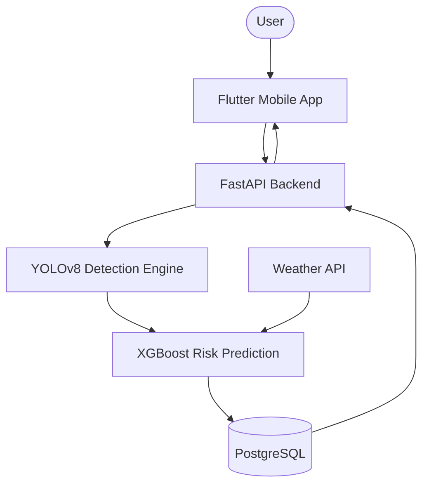
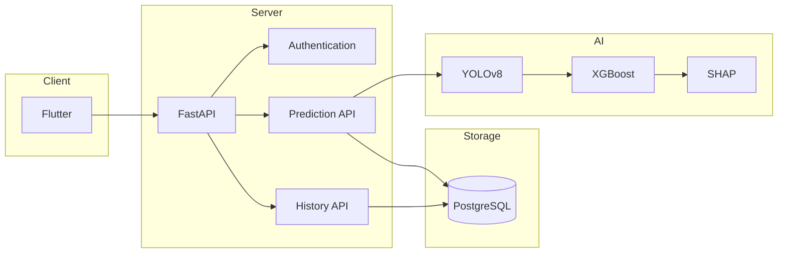
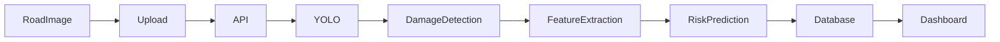
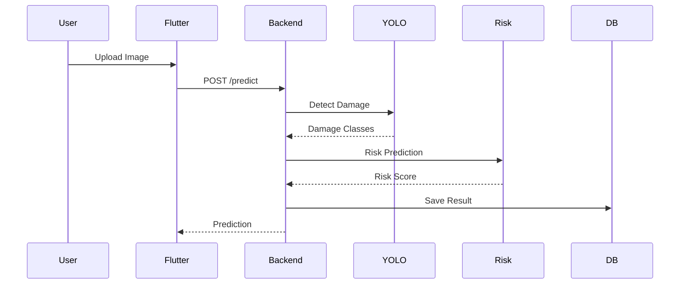
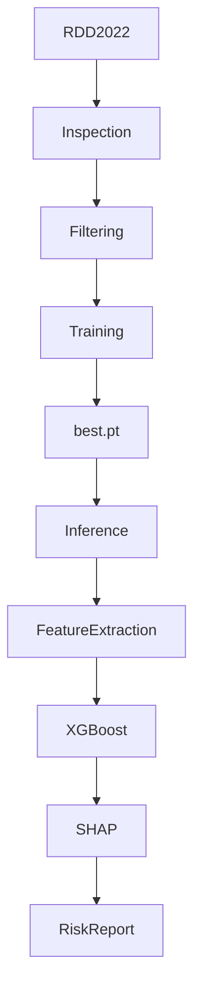
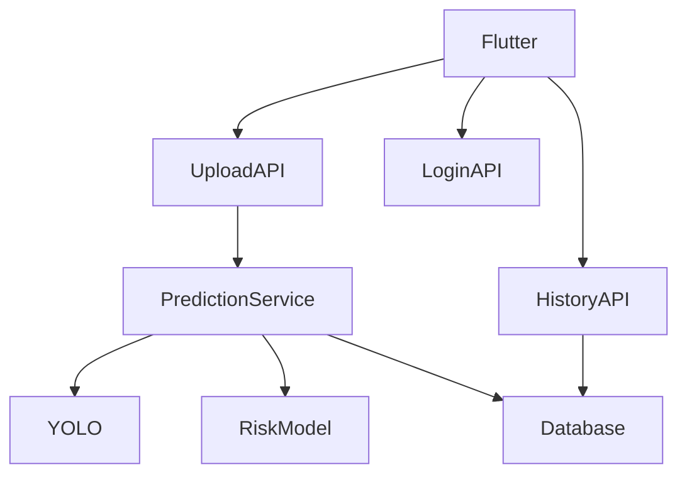
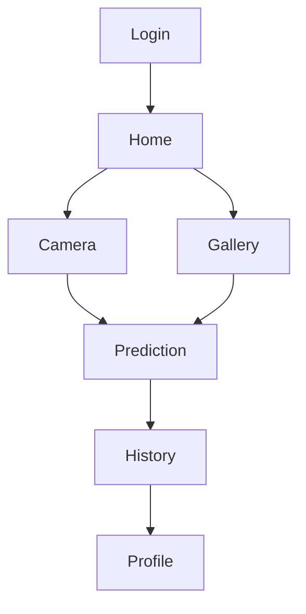
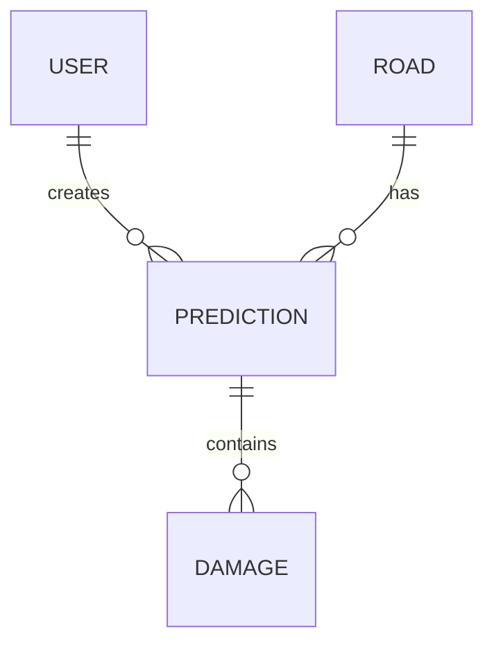
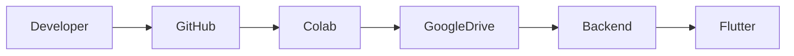

# System Architecture
## InfraGuard AI

> This document explains the complete software architecture of InfraGuard AI and how every module communicates with one another.

---

# Table of Contents

- Overall Architecture
- Component Architecture
- Data Flow
- AI Architecture
- Backend Architecture
- Mobile Application Architecture
- Database Architecture
- Deployment Architecture
- Design Decisions

---

# 1. Overall Architecture

InfraGuard AI follows a modular architecture.

Each module has a single responsibility and communicates through well-defined APIs.

---

# 2. High-Level Component Diagram

---

# 3. Data Flow

---

# 4. Image Prediction Flow

---

# 5. AI Architecture

---

# 6. Backend Architecture

---

# 7. Mobile Architecture

---

# 8. Database Architecture

---

# 9. Deployment Architecture

---

# 10. Why This Architecture?

| Decision | Reason |
|-----------|--------|
| Flutter | Cross-platform mobile app |
| FastAPI | Lightweight, fast REST API |
| YOLOv8 | State-of-the-art object detection |
| XGBoost | Excellent tabular ML performance |
| PostgreSQL | Reliable relational database |
| Google Colab | Free GPU for training |
| Google Drive | Model and dataset storage |

---

# 11. Advantages

- Modular Design
- Easy to Extend
- Independent AI Module
- Independent Backend
- Reusable Components
- Better Testing
- Easy Deployment
- Maintainable Codebase

---

# Related Documents

- PROJECT_MASTER.md
- AI_MODULE.md
- APPLICATION_MODULE.md
- DEVELOPMENT_WORKFLOW.md
